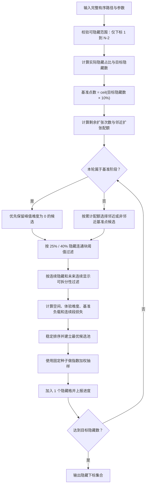

# 隐藏生成算法 1 说明

本文档对应当前项目的 `src/game/algorithm1HiddenLayout.ts`。算法 1 负责基于完整数字路径生成隐藏布局。

运行时将有序路径交给该算法，由它逐次选择需要隐藏的数字。

## 设计目标

算法 1 不是“按概率随机隐藏若干数字”，而是一个逐步构造、带约束的布局优化器。它要同时解决以下问题：

1. **数量可控**：最终隐藏数量必须准确等于配置推导出的目标数量。
2. **空间上不过度成片**：隐藏格不能集中成一整块，否则玩家只能面对一大片无提示区域。
3. **数字序列上不过长**：沿数字路径连续隐藏或连续显示都不能无限延伸。
4. **难度可调**：同一隐藏数量下，通过局部分岔、线索距离和邻近扩张改变推理难度。
5. **结果可复现**：相同路径、参数和种子必须得到相同结果，方便关卡复盘和跨端校验。
6. **始终能产出**：空间约束与连续段约束冲突时，算法逐级降级，而不是生成失败。

这些目标并非同一优先级。当前实现的约束等级如下：

| 规则 | 等级 | 冲突时的处理 |
|---|---|---|
| 首尾数字必须显示 | 绝对约束 | 永不进入候选集合 |
| 精确达到目标隐藏数 | 最高优先级 | 只要存在未隐藏的中间格，就继续选择 |
| 同一输入与种子结果一致 | 绝对约束 | 使用固定种子、稳定排序和固定随机算法 |
| 最长连续隐藏 | 条件硬约束 | 有合法候选时强制；无合法候选时选最接近者 |
| 最长连续显示 | 前瞻约束 | 预留足够后续隐藏次数；不可兼容时逐级放宽 |
| 最大隐藏连通块 40% | 条件硬约束 | 有安全候选时强制；无安全候选时放宽 |
| 优选隐藏连通块 25% | 优化目标 | 优先使用，必要时退到 40% |
| 目标难度 | 优化目标 | 选损失最小的候选，不保证精确命中数值 |
| 唯一解 | 非目标 | 算法允许多解，不执行唯一解修复 |

### 为什么把“精确数量”放在约束之上

运行时难度配置把隐藏比例视为明确输入。如果算法因局部约束提前停止，同一配置会产生不同隐藏数量，关卡统计和策划验收都会失去稳定口径。因此算法选择“数量确定、形态尽量接近约束”，而不是“形态绝对合规、数量不确定”。

## 两套关系必须区分

算法同时使用“数字路径关系”和“棋盘空间关系”，两者不能混为一谈：

| 关系 | 定义 | 主要用途 |
|---|---|---|
| 数字路径关系 | `path[i]` 的前后数字是 `path[i-1]`、`path[i+1]` | 连续隐藏/显示长度、下一个可见线索、线索距离 |
| 棋盘视觉关系 | 格子在棋盘上直接相邻，正方形为四邻接、六边形为六邻接 | 隐藏连通块、显隐边界、局部分岔、基准点扩张、图距离 |

例如数字 12 和数字 40 可能在棋盘上相邻。它们在数字路径上相距很远，但在空间图中会形成直接邻接，影响隐藏连通块和局部选择分岔。

### 为什么需要两套关系

只看数字路径会忽略棋盘上成片隐藏的问题；只看棋盘空间又无法限制玩家连续多少步看不到数字。因此算法分别在两张图上建模，再把结果合并到同一个候选评分中。

## 完整生成流程



主循环可以概括为以下伪代码：

```text
hidden = 空集合
baseHidden = 空集合

for pass in 0 .. targetCount - 1:
    allCandidates = 所有尚未隐藏的中间数字

    if pass < baseCount:
        candidates = 优先选择难度中性的候选
    else:
        candidates = 按邻近扩张配额选择候选分组

    candidates = 按空间连通块阈值逐级过滤(candidates)
    candidates = 按连续隐藏/显示可行性逐级过滤(candidates)

    for candidate in candidates:
        预测加入 candidate 后的所有指标
        计算 candidate 的总损失

    pool = 损失最小的少量候选
    selected = 使用固定种子按指数权重从 pool 抽取
    hidden.add(selected)
    若处于基准阶段：baseHidden.add(selected)

return hidden
```

### 为什么每轮只加入一个隐藏格

连通块、显隐边界、局部分岔和连续段长度都会因每一次选择而变化。如果一次批量选多个格，后面的候选仍基于过期状态评分，容易形成隐藏团块或连续段超限。逐个加入虽然计算量更高，但每一步都能用最新布局重新决策。

## 1. 输入与输出

输入：

- `path`：按数字顺序排列的格子坐标；`path[0]` 是数字 1。
- `shape`：棋盘形状。
- `requestedPercent`：基础隐藏占比。
- `targetDifficulty`：目标难度 1–10。
- `seed`：确定性随机种子。
- `maxVisibleRun`：最长连续显示，默认 8。
- `maxHiddenRun`：最长连续隐藏，默认 4。
- `firstNumberWindow`：开头受限数字窗口，默认 4。
- `maxHiddenInFirstWindow`：开头窗口最多隐藏数量，默认 1。
- `addTargetDifficultyPercent`：是否把目标难度作为额外隐藏百分点，默认 `true`；玩法3和玩法5传 `false`。玩法4不调用算法1。

输出是 `path` 下标集合。首尾数字固定显示，因此下标 `0` 与 `path.Count - 1` 永远不会进入结果；默认情况下，数字 1～4 中最多隐藏 1 个。

## 2. 默认参数与范围

| 参数 | 默认值 | 编辑器范围 | 用途 |
|---|---:|---:|---|
| 最大交叉数量 | 20 | 0–99 | 仅用于路径生成阶段；六边形强制为 0 |
| 路径拐弯概率 | 40% | 0–100% | 仅用于路径生成阶段 |
| 基础隐藏占比 | 35% | 0–100% | 决定目标隐藏数量 |
| 目标难度 | 6 | 1–10 | 同时影响隐藏数量、邻近扩张配额和候选评分 |
| 最长连续显示 | 8 | 1–99 | 尽量限制路径上的连续显示长度 |
| 最长连续隐藏 | 4 | 1–99 | 尽量限制路径上的连续隐藏长度 |
| 开头受限数字数量 | 4 | — | 数字 1～4 受开头隐藏上限约束 |
| 开头最多隐藏数量 | 1 | — | 数字 1～4 最多隐藏 1 个 |
| 额外增加难度百分点 | 是 | 是/否 | 玩法3关闭，配置区间直接作为最终占比 |

## 3. 目标隐藏数量

默认编辑器算法1会直接增加同值的隐藏百分点：

```text
实际隐藏占比 = min(100, clamp(基础隐藏占比, 0, 100) + clamp(floor(难度), 1, 10))
可选上限 = (N - 2) - 开头窗口内可隐藏数 + 开头窗口隐藏上限
目标隐藏数 = min(可选上限, JS_Round(N × 实际隐藏占比 / 100))
```

`N` 为路径长度，`N - 2` 用于排除首尾数字。默认 4/1 配置下，开头窗口内原本可隐藏数字 2、3、4，现在最多选择其中 1 个。`JS_Round` 必须按 JavaScript 的非负数舍入方式实现，即 `floor(x + 0.5)`；不能使用 C# 默认的银行家舍入。

例如 64 格、基础隐藏 35%、难度 6：实际隐藏占比为 41%，目标隐藏数为 `round(64 × 0.41) = 26`。

玩法3调用时设置 `addTargetDifficultyPercent = false`，此时不执行上述加法：

```text
实际隐藏占比 = clamp(配置表选中占比, 0, 100)
```

例如玩法3难度6选中33%，最终仍为33%，不会变成39%，也不需要先减去6%。目标难度仍参与邻近扩张配额和候选布局评分。玩法4使用独立的随机分散选择器，不经过本算法。

### 为什么难度还要增加隐藏百分点

如果难度只改变候选形态，而隐藏总量完全不变，大棋盘在高难度下仍可能保留过多直接线索，难度上限会很快饱和。额外增加 1–10 个百分点，让高难度同时具备“线索更少”和“局部分岔更复杂”两层变化。

这也意味着基础隐藏占比为 0 时，不一定完全不隐藏：实际占比仍会包含难度百分点。若业务需要真正的“零隐藏模式”，应在调用算法 1 前单独短路返回空集合，而不是依赖 `requestedPercent = 0`。

## 4. 基准点新规则

原来的“前 10 个隐藏选择为基准点”已经改为：

```text
基准点数量 = ceil(目标隐藏数 × 10%)
扩张次数 = 目标隐藏数 - 基准点数量
```

基准点数量不会超过目标隐藏数。示例：

| 目标隐藏数 | 基准点数 |
|---:|---:|
| 0 | 0 |
| 1 | 1 |
| 10 | 1 |
| 11 | 2 |
| 64 | 7 |
| 100 | 10 |

基准阶段优先选择“峰值体验难度为 0”的候选，并通过空间损失让这些格子尽量分散。如果当前已经没有难度为 0 的候选，则退回全部候选继续生成。

### 为什么从固定 10 个改为前 10%

固定 10 个不随关卡规模变化：目标只隐藏 12 个时，绝大多数选择都属于难度中性的基准阶段；目标隐藏 100 个时，基准点又过少，后续扩张会集中在少数区域。按目标隐藏数的 10% 取基准点，使“先播种、后扩张”的比例在不同棋盘和隐藏密度下保持一致。

使用向上取整是为了保证只要存在隐藏格，就至少有 1 个基准点。否则目标隐藏数 1–9 时向下取整为 0，算法将直接进入扩张阶段，但此时根本没有可供扩张的基准点。

### 为什么基准点要求难度中性

基准点的职责是建立空间骨架，不是立即制造局部分岔。如果最初几个点就形成高难区域，后续扩张只能在这个偏置上继续叠加，低难度参数也很难拉回。先建立均匀、难度中性的底座，再让扩张阶段根据难度塑形，难度曲线会更稳定。

## 5. 棋盘邻接

- 正方形、长方形、菱形：上、下、左、右四邻接。
- 六边形：按 `x` 列奇偶使用六邻接偏移，与网页端坐标规则一致。

空间连通块、显隐交界、基准点邻近扩张、局部分岔和图距离全部使用这套视觉邻接，而不是路径前后关系。

输入路径应满足以下前置条件：坐标唯一、每个有效格只出现一次、相邻数字符合该棋盘形状的移动规则。当前生成器假设路径已经合法，不在隐藏循环内重复验证，以避免每个候选评分时产生额外开销。

## 6. 扩张配额

难度归一化：

```text
d = (clamp(floor(难度), 1, 10) - 1) / 9
邻近扩张概率 = d × 0.85
邻近扩张次数 = JS_Round(扩张次数 × 邻近扩张概率)
```

难度 1 的邻近扩张次数为 0；难度 10 时约 85% 的扩张次数会优先选择与基准点视觉相邻的格子。配额通过累计比例均匀穿插到整个扩张阶段，不是逐次随机判断。

未安排邻近扩张的轮次优先选择“不与任何基准点相邻”的候选。如果对应候选集合为空，再退回全部候选。

邻近扩张的具体轮次使用累计配额安排：

```text
本轮前已安排数 = floor(expansionIndex × 邻近扩张次数 / 扩张总次数)
本轮后应安排数 = floor((expansionIndex + 1) × 邻近扩张次数 / 扩张总次数)

若“本轮后应安排数 > 本轮前已安排数”，本轮执行邻近扩张。
```

### 为什么不用逐轮随机概率

若每轮独立按概率判断，难度相同但种子不同的关卡可能得到差异很大的邻近扩张总数，策划设置的难度会被随机波动覆盖。先把概率换算成明确次数，再均匀铺到整个阶段，可以确保难度决定扩张总量，随机数只负责在同等质量候选中去除僵硬图案。

### 完整数值示例

以 64 格、基础隐藏 35%、难度 6 为例：

```text
实际隐藏占比 = 35 + 6 = 41%
目标隐藏数 = round(64 × 41%) = 26
基准点数 = ceil(26 × 10%) = 3
扩张次数 = 26 - 3 = 23
难度归一化 = (6 - 1) / 9 ≈ 0.5556
邻近扩张概率 = 0.5556 × 0.85 ≈ 0.4722
邻近扩张次数 = round(23 × 0.4722) = 11
```

最终结构是 3 个分散基准点、11 次优先贴近基准点的扩张、12 次优先远离基准点的扩张。每次选择仍要继续通过空间、连续段和难度评分，不代表邻近轮次可以无条件加入任意相邻格。

## 7. 空间分布约束

加入每个候选前，算法预测：

- 最大隐藏连通块占全部隐藏格的比例。
- 显示/隐藏相邻边占棋盘全部相邻边的比例。

候选过滤优先级：

1. 当前偏好候选中，最大隐藏连通块比例不超过 25%。
2. 全部候选中，不超过 25%。
3. 当前偏好候选中，不超过 40%。
4. 全部候选中，不超过 40%。
5. 如果均不存在，则保留原候选，继续以损失函数选择最接近要求的位置。

基准阶段的主要损失为：

```text
空间损失 = 最大隐藏连通块比例 × 4 - 显隐交界比例 × 2

基准损失 = 空间损失 × 1.2
         + 直接相邻隐藏数 × 8
         + 二环隐藏数 × 1.5
         - 到已有隐藏格的最短图距离 × 0.8
         + 连续段违规损失
```

因此基准点会强烈避免贴在已有隐藏格旁边，并倾向拉开距离、增加显隐交错边界。

### 为什么同时设置 25% 和 40% 两级阈值

25% 是期望形态，用于优先得到多块、小块、交错的隐藏区域；40% 是安全上限，用于防止出现占据多数隐藏格的大团块。如果只设 25% 单一硬阈值，高隐藏密度或特殊棋盘形状很容易没有候选；如果只设 40%，算法又会过早接受较大的隐藏团块。两级阈值让算法先追求理想分布，再在必要时保持可生成性。

这里的比例分母是“当前全部隐藏格数量”，不是棋盘总格数。例如当前有 20 个隐藏格，最大隐藏连通块为 5 个，则比例为 25%。

### 为什么奖励显隐交界

显隐相邻边越多，隐藏格与可见线索越交错，玩家通常能从多个方向获得局部信息。相反，如果隐藏格和显示格各自形成一整片，即使隐藏数量相同，也会出现大面积无提示区域。因此损失函数减去显隐交界比例，使交错布局更优。

### 生成评分与统计指标的区别

完整空间统计还包含“最大显示连通块比例”，用于关卡分析和测试；逐候选生成时为了降低计算量，增量空间损失只直接使用最大隐藏连通块比例与显隐交界比例。连续显示问题由数字路径上的 `maxVisibleRun` 单独处理，两者关注的不是同一类结构。

## 8. 连续显示/隐藏约束

每次尝试加入候选后，算法计算：

- 当前最长连续隐藏长度。
- 当前最长连续显示长度。
- 为把所有显示段拆到限制以内，后续至少还需隐藏多少格。

优先保留同时满足以下条件的候选：

```text
最长连续隐藏 <= maxHiddenRun
最低额外隐藏需求 <= 剩余选择次数
```

如果与目标隐藏数量无法同时满足，算法会逐级放宽“未来可拆分显示段”的要求，再放宽候选集合。最终优先保证精确隐藏数量，因此这两个参数是“可满足时的硬约束”，不可满足时不会返回失败。

连续段候选的实际降级顺序是：

1. 当前空间偏好候选中，同时满足最长隐藏和未来显示可拆分性。
2. 所有 40% 连通块安全候选中，同时满足两项要求。
3. 所有候选中，同时满足两项要求。
4. 当前空间偏好候选中，只满足最长隐藏。
5. 所有 40% 连通块安全候选中，只满足最长隐藏。
6. 所有候选中，只满足最长隐藏。
7. 如果仍为空，保留进入本阶段前的候选，并通过高额违规损失选最接近限制的位置。

### “最低额外隐藏需求”如何计算

对于长度为 `L` 的连续显示段，要保证每段长度不超过 `maxVisibleRun`，至少需要：

```text
floor(L / (maxVisibleRun + 1))
```

个额外隐藏格来切开它。算法对当前所有显示段求和，再与剩余选择次数比较。这样不是只检查“当前是否超限”，而是提前避免进入一种未来已经无法修复的状态。

### 为什么连续显示要前瞻，连续隐藏可以立即判断

加入新隐藏格会立即延长或合并隐藏段，因此最长连续隐藏可以直接判定。连续显示则相反：当前过长的显示段可能在后续被新隐藏格切开，所以不能过早拒绝；需要判断剩余次数是否足够完成拆分。

当无法满足限制时，违规损失使用较大权重：隐藏超限和最低额外需求不足每单位罚 50；最后一轮仍有显示超限时每单位罚 5。前两项决定结构是否仍可修复，因此处罚更重。

## 9. 体验难度估算

若路径的下一个数字可见，该步得分为 0。若下一个数字隐藏：

1. 找到后方第一个可见数字及其线索距离。
2. 统计当前位置视觉相邻的后续隐藏候选。
3. 深度搜索恰好使用指定步数到达下一可见数字的隐藏路线。
4. 搜索不允许重复格子，并最多记录 100 条分支。
5. 根据局部错误选择、多个有效首选、额外推理分支和线索距离计算单步得分，最高 5 分。

```text
单步得分 = min(5,
    局部错误选择 × (0.9 + max(0, 线索距离 - 2) × 0.18)
  + 额外有效首选 × 0.25
  + 额外推理分支 × 0.12
  + max(0, 线索距离 - 2) × 0.06)
```

全局体验指标：

- 平均难度：全部路径步骤的平均得分。
- 困难步骤占比：得分不低于 1 的步骤比例。
- 峰值难度：最高单步得分。

难度 1–10 各有一组目标指标。生成进度较低时，目标指标也按当前进度缩放，避免算法过早堆出高难区域。

目标表如下：

| 难度 | 平均难度 | 困难步骤占比 | 峰值难度 |
|---:|---:|---:|---:|
| 1 | 0.02 | 0.01 | 0.3 |
| 2 | 0.06 | 0.04 | 0.6 |
| 3 | 0.12 | 0.08 | 1.0 |
| 4 | 0.20 | 0.14 | 1.4 |
| 5 | 0.30 | 0.20 | 1.9 |
| 6 | 0.42 | 0.27 | 2.4 |
| 7 | 0.56 | 0.34 | 3.0 |
| 8 | 0.70 | 0.40 | 3.6 |
| 9 | 0.84 | 0.46 | 4.2 |
| 10 | 1.00 | 0.52 | 5.0 |

绝对难度目标损失为：

```text
|平均难度 - 目标平均难度 × progress| / 0.3 × 0.5
+ |困难占比 - 目标困难占比 × progress| / 0.2 × 0.3
+ |峰值难度 - 目标峰值难度 × progress| / 1.5 × 0.2
```

### 为什么使用三个指标而不是一个总分

只控制平均值可能得到“绝大多数步骤很简单、少数步骤极难”的尖峰布局；只控制峰值又无法区分困难步骤出现一次还是频繁出现。平均值控制整体负担，困难占比控制困难出现频率，峰值控制单步上限，三者组合后难度形态更稳定。

### 为什么按生成进度缩放目标

布局只完成一小部分时，最终目标难度尚不可能完整出现。如果从第一轮就要求达到最终峰值，算法会过早集中隐藏格制造分岔，破坏基准分布。用 `progress = 已完成选择数 / 目标隐藏数` 缩放目标，让难度随布局逐步形成。

## 10. 扩张阶段候选评分

候选的体验值先在本轮全部候选中归一化到 0–1，再与目标难度的归一化值比较。主要损失为：

```text
扩张损失 = 相对体验偏差 × 8
         + 绝对难度目标损失 × 0.5
         + 空间损失 × 0.35
         + 直接相邻隐藏数 × 0.45
         + 二环隐藏数 × 0.15
         + 基准点当前负载 × 1.2
         - 到已有隐藏格距离 × 0.05
         + 连续段违规损失
```

高难度会倾向选择局部分岔更多、线索距离更长的布局；低难度则倾向较低体验值。

体验值本身为：

```text
体验值 = 平均难度 × 2.5 + 困难步骤占比 × 2 + 峰值难度 × 0.4
```

每轮会用本轮候选的最小值和最大值把体验值归一化到 0–1，再与 `(难度 - 1) / 9` 比较。如果本轮所有候选体验值相同，则统一使用 0.5。

### 为什么同时使用相对难度和绝对难度

不同棋盘形状、路径结构和生成阶段可达到的绝对难度范围不同。相对难度确保难度 1 总是偏向本轮较简单的候选、难度 10 总是偏向本轮较困难的候选；绝对目标损失则防止算法只做相对排序却整体偏离预设难度表。

### 各附加项为什么存在

- **直接相邻隐藏数**：避免扩张无限贴成实心团块。
- **二环隐藏数**：抑制稍远一圈的隐性聚集，防止只检查直接邻接时形成厚重区域。
- **基准点负载**：统计相邻基准点周围已有多少非基准隐藏格，优先扩张负载较低的基准点，避免所有扩张集中在同一个种子上。
- **图距离奖励**：在非邻近轮次轻微鼓励开辟新区域；扩张阶段权重很小，避免抵消难度目标。
- **连续段违规损失**：保证体验优化不能轻易压过结构可行性。

## 11. 最终选择与确定性

候选按损失升序稳定排序：

- 基准阶段最多取前 5 个候选进入抽样池。
- 扩张阶段最多取前 2 个候选进入抽样池。
- 使用指数权重在池内抽取，基准阶段温度 0.75，扩张阶段温度 0.12。

同一条路径、参数和种子会生成相同布局。C# 文件已复现：

- JavaScript 32 位乘法/异或种子口径。
- 网页端 `createRandom` 随机数算法。
- JavaScript 非负数 `Math.round`。
- 稳定候选排序。

隐藏阶段种子：

```text
imul(generationIndex + 1, 104729)
XOR imul(rows + 1, 73856093)
XOR imul(columns + 1, 19349663)
XOR path.Count
XOR 0x2b7e1516
```

随机数初始化时还会再与 `0x6f29d417` 异或。

候选池大小的准确公式是：

```text
基础池大小 = min(5, max(1, ceil(sqrt(候选数) / 2)))
扩张池大小 = min(2, max(1, ceil(sqrt(候选数) / 2)))
```

池内权重：

```text
weight = exp(-(candidateLoss - bestLoss) / temperature)
```

基准阶段 `temperature = 0.75`，允许更丰富的分散形态；扩张阶段 `temperature = 0.12`，更接近确定地选择最优项。

### 为什么不总是选择损失最低的唯一候选

如果永远取第一名，规则棋盘在相似参数下会反复产生同一种机械纹理。只在少量最优候选中做加权抽样，既保留质量，又能让不同种子产生受控变化。由于随机数、候选顺序和种子固定，同一输入仍然完全可复现。

## 12. C# 接入示例

```csharp
using NCWeb.Algorithms;

// path 必须已经按数字顺序排列。
IReadOnlyList<Cell> path = LoadSolutionPath();

int seed = Algorithm1HiddenGenerator.BuildSeed(
    generationIndex,
    rows,
    columns,
    path.Count);

HashSet<int> hiddenIndices = Algorithm1HiddenGenerator.SelectHiddenLayout(
    path,
    BoardShape.Square,
    requestedPercent: 35,
    targetDifficulty: 6,
    seed,
    new Algorithm1HiddenLayoutOptions
    {
        MaxVisibleRun = 8,
        MaxHiddenRun = 4,
        AddTargetDifficultyPercent = true,
    });

// 转成坐标；排序仅用于得到稳定的序列化顺序。
Cell[] hiddenCells = hiddenIndices
    .OrderBy(index => index)
    .Select(index => path[index])
    .ToArray();
```

算法允许同一组显示数字对应多条完整解，不执行唯一解修复。如果业务端要求唯一解，需要在算法 1 输出后另加求解器校验与显格修复步骤。

## 13. 边界情况与明确行为

| 情况 | 当前行为 |
|---|---|
| 路径长度不超过 2 | 可隐藏数量为 0，返回空集合，进度直接上报 100% |
| 基础隐藏占比为 0 | 默认仍会加难度百分点；关闭额外百分点后为 0 |
| 基础隐藏占比与难度之和超过 100 | 默认截断为 100%；关闭额外百分点后只截断基础占比 |
| 目标隐藏数为 1–9 | 基准点数向上取整为 1 |
| 没有难度中性的基准候选 | 退回全部当前候选，不停止生成 |
| 没有 25% 连通块候选 | 依次退到全局 25%、偏好 40%、全局 40% |
| 没有 40% 连通块安全候选 | 放宽连通块限制，通过损失选最接近者 |
| 连续段限制与目标数量冲突 | 优先保证目标隐藏数量，选择违规最小的候选 |
| 六边形棋盘 | 使用奇偶列六邻接；路径阶段最大交叉数强制为 0 |
| 相同输入重复调用 | 返回相同隐藏集合 |
| 不同种子 | 可能在同等质量候选间产生不同布局 |

算法把隐藏布局视为集合。C# 的 `HashSet` 枚举顺序不属于业务语义；保存或跨端比较时应按路径下标或坐标排序。

## 14. 参数调整会产生什么结果

| 调整 | 直接影响 | 常见结果 |
|---|---|---|
| 提高基础隐藏占比 | 增加目标隐藏数 | 线索更少；空间和连续段约束更容易发生降级 |
| 提高目标难度 | 增加隐藏百分点、邻近扩张配额和目标体验值 | 隐藏更多、局部分岔更多、线索距离通常更长 |
| 降低最长连续显示 | 要求更频繁地插入隐藏格切段 | 隐藏分布沿数字路径更均匀 |
| 降低最长连续隐藏 | 阻止数字序列上长段连续隐藏 | 可见数字更频繁，但高隐藏比例下更可能与数量冲突 |
| 提高路径拐弯概率 | 改变上游完整路径形态 | 空间相邻但数字序号相距较远的情况可能增加，进而改变分岔评分 |
| 提高最大交叉数量 | 改变上游路径候选 | 空间局部分支可能增加；六边形不适用 |

不要把“难度”理解为单纯的随机概率。它同时作用于隐藏总量、邻近扩张次数、相对体验目标和绝对体验目标，因此是一个复合参数。

## 15. 开发实现时最容易出错的地方

1. **10% 的分母是目标隐藏数**：不是棋盘格数，也不是可隐藏格数。
2. **10% 使用向上取整**：`ceil(targetCount × 0.1)`，不是 `round` 或 `floor`。
3. **目标隐藏数使用 JavaScript 舍入**：非负数应为 `floor(x + 0.5)`；C# `Math.Round` 默认银行家舍入会在 `4.5` 等值上产生不同结果。
4. **首尾不进入候选**：不能先全局选择再删除首尾，否则最终数量会减少。
5. **空间邻接不等于数字前后**：连通块、分岔和距离必须按棋盘形状建图。
6. **六边形邻接依赖列奇偶**：偏移规则写反会导致跨端结果完全不同。
7. **邻近扩张是明确配额**：不能改写成每轮独立 `random < probability`。
8. **基准集合生成后保持固定**：扩张阶段选出的隐藏格不能再加入 `baseHidden`。
9. **排序必须稳定**：损失相等时需保留候选原始顺序，否则相同种子也可能跨端不一致。
10. **随机数必须使用 32 位溢出**：C# 需要 `unchecked`，并复现网页端随机算法。
11. **约束需要保留降级链**：直接把 25%、40% 或连续段限制写成失败返回，会改变“始终产出”的产品行为。
12. **集合输出不要依赖枚举顺序**：跨端测试应比较排序后的下标或坐标。

## 16. 性能特征

设目标隐藏数为 `H`，某轮候选数为 `C`，路径长度为 `N`。算法每轮会为多个候选重复计算空间状态、连续段状态和体验指标，因此总体开销明显高于简单随机隐藏。

主要开销来自：

- 构建和预测隐藏连通块。
- 为每个候选扫描完整数字路径，计算连续段与体验得分。
- 对隐藏线索段做局部深度搜索。

推理分支搜索最多记录 100 条路线，防止高分岔区域指数爆炸。当前实现更偏向生成质量和确定性，而不是最低计算量。

若 C# 端需要生成大量大棋盘，建议先保持逻辑一致完成验收，再考虑以下无行为变化的优化：

- 缓存与候选无关的邻接表和棋盘边数。
- 复用集合与数组，减少每轮分配。
- 对连续段状态做增量更新。
- 缓存不受候选影响的体验计算片段。
- 在保证候选原始顺序的前提下并行计算候选指标。

不要在首次移植时同时修改权重、搜索上限或候选降级顺序，否则很难判断跨端差异来自语言实现还是算法改动。

## 17. 验收与回归测试清单

至少应覆盖以下测试：

1. `targetCount = 0/1/10/11/64/100` 时，基准点数分别为 `0/1/1/2/7/10`。
2. 9 格路径、基础占比 0、难度 3，隐藏数为 0。
3. 9 格路径、基础占比 33、难度 3，隐藏数为 3。
4. 9 格路径、基础占比 100、难度 3，隐藏数为 7，且首尾未隐藏。
5. 64 格路径、基础占比 35、难度 1，隐藏数为 23。
6. 64 格路径、基础占比 35、难度 10，隐藏数为 29。
7. 同一输入、参数和种子调用两次，排序后的隐藏下标完全相同。
8. 难度 10 的体验值应明显高于难度 1 的体验值。
9. 存在安全候选时，最大隐藏连通块比例不超过 40%。
10. 约束可满足时，最长连续显示和隐藏不超过配置值。
11. 正方形与六边形使用各自邻接规则，并得到确定结果。
12. TypeScript 与 C# 使用相同路径、参数和种子时，排序后的隐藏下标一致。

当前仓库已经覆盖核心数量、确定性、难度趋势、连通块上限和连续段限制；C# 文件也已通过编译及关键数量样例验证。
