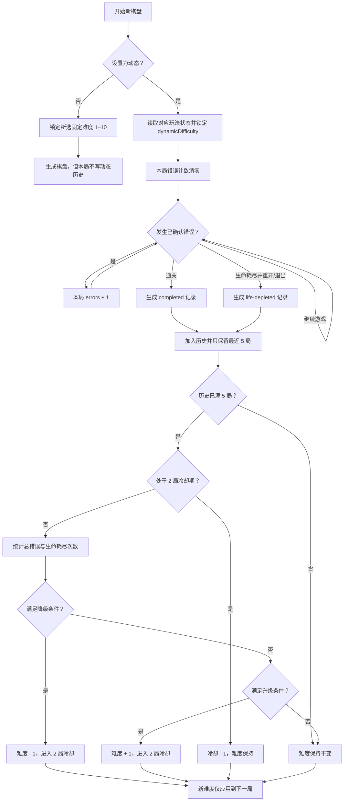

# 最近 5 局错误次数动态难度方案（玩法3 / 玩法4 / 玩法5）

## 1. 方案结论

玩法3、玩法4和玩法5都使用整数动态难度 `1–10`；玩法3和玩法4初始值为 `6`，玩法5初始值为 `1`。三个玩法各自保存最近 5 局、当前难度和关卡进度，互不影响。

每结束一个有效对局，记录本局错误次数，只保留最近 5 局。满 5 局后，根据窗口内的错误总数决定下一局难度：

| 最近 5 局统计 | 动作 |
|---|---|
| 总错误 `0–2`，且没有生命耗尽 | 动态难度 `+1` |
| 总错误 `3–7`，且生命耗尽少于 2 次 | 保持不变 |
| 总错误 `8–15` | 动态难度 `-1` |
| 生命耗尽达到 2 次 | 无论总错误是否达到 8，动态难度 `-1` |

难度始终限制在 `1–10`，每次最多变化 1 级。发生调整后，接下来的 2 个有效对局只收集数据、不再次调整；第三局结束后恢复判断。

动态难度只用于生成**下一局**，绝不在当前棋盘中途改变隐藏格。

设置页同时提供手动覆盖：`动态`、`难度 1` 到 `难度 10`。`动态`是默认值；固定档位用于策划验收或玩家主动选择，切换后立即放弃当前未完成布局并按所选档位重新生成同一关。

## 2. 设计目标

这版方案解决五个问题：

1. **玩家持续轻松时提高挑战**：最近 5 局几乎不出错，说明当前难度低于玩家能力。
2. **玩家持续受挫时降低难度**：错误较多或反复耗尽生命，说明当前难度过高。
3. **正常波动时不调整**：一次手滑不能造成难度频繁升降。
4. **规则可解释**：策划、开发和玩家都能理解“为什么升、为什么降”。
5. **两种玩法职责清晰**：玩法3调整算法1的 `targetDifficulty`；玩法4不使用难度评分算法，只按难度档位切换隐藏区间和连续段限制。

V1 刻意不使用复杂机器学习、胜率预测或黑盒评分。先建立稳定、可观测的基线，再通过真实数据调整阈值。

### 2.1 玩法3固定配置

玩法3在所有动态难度下都固定使用：

| 隐藏占比 | 最长连续显示 | 最长连续隐藏 |
|---|---:|---:|
| `[20,40]` | 3 | 3 |

每个关卡用稳定种子从闭区间 `[20,40]` 中选一个整数占比。重玩同一关时占比不变；动态难度升降只改变算法 1 的 `targetDifficulty`，从而改变候选布局的难度目标和扩张策略。

### 2.2 玩法4动态配置

玩法4保留玩法3的最近 5 局升降规则，并在下一局生成时按当前动态难度切换整套参数：

| 动态难度 | 隐藏占比 | 最长连续显示 | 最长连续隐藏 |
|---:|---:|---:|---:|
| 1 | `[10,15]` | 5 | 2 |
| 2 | `[15,20]` | 5 | 2 |
| 3 | `[20,25]` | 4 | 2 |
| 4 | `[25,30]` | 4 | 2 |
| 5 | `[30,35]` | 3 | 3 |
| 6 | `[35,40]` | 3 | 3 |
| 7 | `[40,45]` | 2 | 4 |
| 8 | `[45,50]` | 2 | 4 |
| 9 | `[50,55]` | 2 | 5 |
| 10 | `[55,60]` | 2 | 5 |

区间取值同样由关卡稳定种子决定，因此同一关、同一档位重玩时布局参数稳定。难度改变后，新的配置只从下一局开始生效。

玩法4的隐藏位置使用固定种子的简单随机分散选择器。选择器不接收 `targetDifficulty`，也不计算平均难度、困难步骤或候选体验损失；不同档位的差异只来自上表配置。数字1和末尾固定显示，数字1～4中最多隐藏1个。

### 2.3 动态与固定难度选择

设置项 `mainGameplayDifficulty` 的合法值是：

```text
dynamic, 1, 2, 3, 4, 5, 6, 7, 8, 9, 10
```

- 选择 `dynamic`：玩法3读取玩法3自己的动态状态，玩法4读取玩法4自己的动态状态；有效对局继续写入对应玩法的最近5局历史。
- 选择固定 `1–10`：该数字直接作为本局生成难度。玩法3用它作为算法1目标难度，玩法4用它定位10档配置表；固定难度对局不写入动态历史。
- 从固定档切回 `dynamic`：继续使用切换前已经保存的动态难度和历史，不用固定档覆盖动态状态。
- 在玩法3/4对局内切换选项：重置生命和本局错误计数，立即用同一关卡路径重建棋盘。若旧的动态对局已经生命耗尽，先按旧对局记录失败，再重建；普通未完成尝试不计局。
- 拼豆和拼图不使用这项设置，界面保留当前值但禁用控件。

玩法5遵循同一选择规则，但读取自己的配置、生成器和动态状态。玩法5实现细节见 [玩法5独立实现说明](./gameplay5-implementation.md)。

这样把“玩家能力估计”和“手动指定生成参数”分开：固定档可稳定比较同一阵型的10档差异，又不会污染真实玩家表现数据。

## 3. 核心概念

### 3.1 什么算“一局”

一局指一次棋盘尝试，从棋盘开始到以下任一终点：

- 完整通关：记录为 `completed`。
- 生命耗尽后选择重新开始或退出：记录为 `life-depleted`。

生命耗尽后观看视频继续，仍属于同一局，不要立即写入历史；最终通关时记录这整局累计错误数。如果之后再次耗尽并选择重开，才记录为失败。

V1 不统计以下场景：

- 编辑器试玩。
- 快速完成或显示完整答案。
- 尚未产生错误就主动退出的未完成棋盘。
- 每日挑战、无尽模式等已有独立难度曲线的模式。

当前只在普通模式且难度选择为 `dynamic` 的玩法3、玩法4和玩法5启用。三个玩法维护独立的最近 5 局历史；固定难度、无尽、每日挑战、拼豆和拼图不进入这套统计。

### 3.2 什么算一次错误

沿用当前棋盘已经确认并触发 `onWrong` / `level.wrong-move` 的行为，每次回调记 1 次。包括：

- 起点顺序错误。
- 从不可作为起点的隐藏格开始。
- 连接到非连续数字。
- 方向或连接规则不合法。
- 当前连接无法完成正确路径。

不计入错误：

- 仅移动指针但没有被判定为错误。
- 使用撤销、画笔、油漆桶等道具。
- UI 点击、暂停、打开设置。

错误计数必须在棋盘层完成防抖之后进行，不能直接按 `pointermove` 或重复碰撞次数统计，否则一次操作可能被记多次。

### 3.3 原始错误数与难度评分错误数

每局保存真实的 `rawErrors` 供分析，但进入动态难度公式时使用：

```text
scoredErrors = min(rawErrors, 3)
```

原因是普通模式初始只有 3 条生命。玩家观看视频继续后可能累计 4 次以上错误，但不能让单局广告续命无限放大整个 5 局窗口。是否耗尽生命单独用 `lifeDepleted` 表示。

## 4. 状态结构

建议持久化以下数据：

```ts
interface DynamicDifficultyGameRecord {
  errors: number;                 // 本局真实错误数，非负整数
  result: 'completed' | 'life-depleted';
  levelId: number;
  finishedAtUtc: string;
}

interface DynamicDifficultyState {
  version: 1;
  currentDifficulty: number;      // 1–10
  recentGames: DynamicDifficultyGameRecord[]; // 最多 5 条，旧 -> 新
  cooldownGames: number;          // 调整后固定为 2
  totalEligibleGames: number;
}
```

当前存储键：

```text
玩法3：number-connect.dynamic-difficulty.v1
玩法4：number-connect.mode4-dynamic-difficulty.v1
玩法5：number-connect.mode5-dynamic-difficulty.v1
```

加载时需要归一化：

- 难度截断到 `1–10` 并取整数。
- 错误次数截断为不小于 0 的整数。
- 非法结果类型丢弃。
- 历史只保留最后 5 条。
- 冷却局数截断为 `0–2`。
- 数据损坏时回退到默认难度 6 和空历史。

## 5. 完整流程



## 6. 判断公式

最近 5 局为 `g1 ... g5`，其中 `g5` 是最新一局：

```text
windowErrors = Σ min(game.errors, 3)
failedGames = count(game.result == life-depleted)
```

判断顺序必须先降级、后升级：

```text
if failedGames >= 2 or windowErrors >= 8:
    delta = -1
else if failedGames == 0 and windowErrors <= 2:
    delta = +1
else:
    delta = 0
```

最终难度：

```text
nextDifficulty = clamp(currentDifficulty + delta, 1, 10)
```

只有 `nextDifficulty != currentDifficulty` 时才启动 2 局冷却。如果已经在难度 10 且得到升级判断，难度保持 10，也不需要启动冷却。

## 7. 为什么这样分档

设计目标是让玩家稳定在平均每局约 1 次错误，而不是追求完全零错误。

### 升级区：总错误 0–2

5 局合计最多 2 次错误，相当于平均每局不超过 0.4 次，且没有生命耗尽，说明玩家对当前结构已经非常熟练。玩法3升 1 级会提高算法1的布局难度目标；玩法4升 1 级只切换到下一档隐藏区间和连续段限制，不会一次跨越多个等级。

### 保持区：总错误 3–7

相当于平均每局 0.6–1.4 次错误。这个区间既有挑战又不会频繁失败，是 V1 的目标体验带。设置较宽的保持区本身就是迟滞设计，可避免在阈值附近来回震荡。

### 降级区：总错误 8–15

平均每局至少 1.6 次错误，说明当前难度开始持续造成阻碍。玩法3降 1 级后，算法1会降低邻近扩张配额和目标体验复杂度；玩法4只切换到更低一档配置，玩法3的固定占比与连续段参数保持不变。

### 两次生命耗尽提前降级

可能出现错误记录 `[3, 0, 3, 0, 0]`，总错误只有 6，按总量仍属于保持区，但玩家已经两次无法完成关卡。失败是比普通错误更强的受挫信号，因此优先触发降级。

## 8. 防抖和保护规则

### 8.1 至少收集 5 局

历史不足 5 局时不调整。单局结果受手滑、环境打断和首次理解规则影响较大，不能代表稳定能力。

### 8.2 每次最多变化 1 级

玩法3的 `targetDifficulty` 会改变扩张配额和布局评分；玩法4一次跨级会同时改变隐藏占比和连续段参数。一次跳2–3级会让体验突变，因此每次只允许升降1级。

### 8.3 调整后冷却 2 局

调整后的前两局仍写入最近 5 局，但不再次调整。第三局结束后才允许重新判断，让窗口中至少加入两条新难度下的数据。

伪代码中应先判断“本局开始前是否处于冷却”，再将冷却减 1；这样设置为 2 才能确保完整跳过后续两次判断。

### 8.4 只作用于下一局

棋盘开始后隐藏布局必须保持不变。中途改变隐藏格会破坏玩家已经建立的空间记忆，也会使关卡无法复盘。

### 8.5 玩法隐藏比例不再叠加难度百分点

玩法3/玩法4的配置区间现在直接代表最终隐藏占比：

```text
实际隐藏占比 = effectivePercent
```

玩法3调用算法1隐藏布局生成器时传入：

```text
requestedPercent = effectivePercent
addTargetDifficultyPercent = false
```

玩法4不再调用算法1，直接把 `effectivePercent` 交给随机分散选择器。两种玩法都不执行 `effectivePercent - targetDifficulty` 的反向扣减，也不把 `targetDifficulty%` 加到隐藏占比。只有玩法3继续使用 `targetDifficulty` 做布局结构评分。

## 9. 隐藏生成接入

下一局生成前：

```ts
const dynamicState = loadDynamicDifficultyState();
const difficulty = dynamicState.currentDifficulty;

const effectivePercent = hiddenPercentForLevel(level, config.hiddenPercentRange);

const hiddenIndices = mode === 'mode3'
  ? selectAlgorithm1HiddenLayout(
      path,
      shape,
      effectivePercent,
      difficulty,
      mode3Seed,
      {
        maxVisibleRun,
        maxHiddenRun,
        addTargetDifficultyPercent: false,
      },
    )
  : selectMode4RandomDispersedHiddenLayout(
      path,
      effectivePercent,
      mode4SeedWithoutDifficulty,
      {
        maxVisibleRun,
        maxHiddenRun,
        firstNumberWindow: 4,
        maxHiddenInFirstWindow: 1,
      },
    );
```

难度变化会影响：

1. 玩法3：算法1的相邻扩张次数、候选体验目标和布局评分。
2. 玩法4：只切换隐藏占比区间、最长连续显示和最长连续隐藏。
3. 玩法4随机种子不包含难度，不能把难度值偷偷混入随机序列。

当前网页运行时由 `makeSession` 识别玩法3/玩法4，并忽略关卡文件中的固定 `hiddenCells`。玩法3调用算法1；玩法4调用随机分散选择器。两种玩法共用 `mode3-levels.json` 的24关路径，但使用独立的关卡进度和难度历史。

### 为什么采用运行时生成

运行时生成可以直接响应玩家最新能力，无需为24关预存10套布局。相同关卡和配置复用确定性种子，所以重开时结果稳定；难度调整只会在创建下一块棋盘时被读取。玩法3和玩法4主动忽略关卡文件中的 `hiddenCells`，避免状态数值已经变化、棋盘却仍加载旧固定布局。

## 10. 当前项目的事件接入点

动态难度状态位于 `src/gameplay/mode3/dynamicDifficulty.ts`；玩法配置与运行时路由位于 `src/gameplay/mode3/mode3HiddenLayout.ts`；玩法4随机分散选择器位于 `src/gameplay/mode3/mode4RandomHiddenLayout.ts`。

接入位置：

1. `setCurrentBoard`：锁定本局难度、错误计数清零。
2. `handleWrong`：除现有生命扣减外，`currentAttemptErrorCount += 1`。
3. 成功完成当前棋盘：记录 `completed`。
4. 生命耗尽后选择重开或退出：记录 `life-depleted`。
5. 观看视频继续：不结束本局，不记录历史。
6. 生成下一棋盘：读取调整后的动态难度。

不要只从 `3 - lives` 推导错误数：观看视频会增加生命，无尽模式也会奖励生命。必须使用独立累计字段。

为了防止同一局重复写入，可以增加：

```ts
private currentAttemptRecorded = false;
```

终局写入前检查并立即置为 `true`。

## 11. C# 参考实现

```csharp
using System;
using System.Collections.Generic;
using System.Linq;

public enum DynamicGameResult
{
    Completed,
    LifeDepleted,
}

public sealed record DynamicGameRecord(int Errors, DynamicGameResult Result);

public sealed class DynamicDifficultyState
{
    public int CurrentDifficulty { get; set; } = 6;
    public List<DynamicGameRecord> RecentGames { get; } = new();
    public int CooldownGames { get; set; }
    public int TotalEligibleGames { get; set; }
}

public sealed record DynamicDifficultyDecision(
    int PreviousDifficulty,
    int CurrentDifficulty,
    int WindowErrors,
    int FailedGames,
    int Delta,
    string Reason,
    int CooldownGames);

public static class DynamicDifficultyController
{
    private const int WindowSize = 5;
    private const int AdjustmentCooldown = 2;

    public static DynamicDifficultyDecision RecordGame(
        DynamicDifficultyState state,
        int rawErrors,
        DynamicGameResult result)
    {
        ArgumentNullException.ThrowIfNull(state);

        state.RecentGames.Add(new DynamicGameRecord(
            Math.Max(0, rawErrors),
            result));
        while (state.RecentGames.Count > WindowSize)
            state.RecentGames.RemoveAt(0);
        state.TotalEligibleGames += 1;

        int previous = Math.Clamp(state.CurrentDifficulty, 1, 10);
        state.CurrentDifficulty = previous;
        int windowErrors = state.RecentGames.Sum(game => Math.Min(game.Errors, 3));
        int failedGames = state.RecentGames.Count(game =>
            game.Result == DynamicGameResult.LifeDepleted);

        if (state.RecentGames.Count < WindowSize)
        {
            return new DynamicDifficultyDecision(
                previous, previous, windowErrors, failedGames, 0,
                "warm-up", state.CooldownGames);
        }

        // 本局开始前处于冷却，就完整跳过本次判断，然后冷却减 1。
        if (state.CooldownGames > 0)
        {
            state.CooldownGames -= 1;
            return new DynamicDifficultyDecision(
                previous, previous, windowErrors, failedGames, 0,
                "cooldown", state.CooldownGames);
        }

        int requestedDelta;
        string reason;
        if (failedGames >= 2)
        {
            requestedDelta = -1;
            reason = "two-life-depleted-games";
        }
        else if (windowErrors >= 8)
        {
            requestedDelta = -1;
            reason = "too-many-errors";
        }
        else if (failedGames == 0 && windowErrors <= 2)
        {
            requestedDelta = 1;
            reason = "too-few-errors";
        }
        else
        {
            requestedDelta = 0;
            reason = "target-band";
        }

        int next = Math.Clamp(previous + requestedDelta, 1, 10);
        int actualDelta = next - previous;
        state.CurrentDifficulty = next;
        if (actualDelta != 0)
            state.CooldownGames = AdjustmentCooldown;

        return new DynamicDifficultyDecision(
            previous,
            next,
            windowErrors,
            failedGames,
            actualDelta,
            actualDelta == 0 && requestedDelta != 0 ? "difficulty-bound" : reason,
            state.CooldownGames);
    }
}
```

## 12. 示例

假设当前动态难度为 6。

### 示例 A：玩家明显轻松

```text
最近 5 局错误：[0, 0, 1, 0, 1]
错误总数：2
生命耗尽：0
结果：难度 6 -> 7，随后冷却 2 局
```

### 示例 B：处于目标体验带

```text
最近 5 局错误：[1, 0, 2, 1, 1]
错误总数：5
生命耗尽：0
结果：难度保持 6
```

### 示例 C：错误持续偏多

```text
最近 5 局错误：[2, 2, 1, 3, 2]
评分错误总数：10
结果：难度 6 -> 5，随后冷却 2 局
```

### 示例 D：两次失败优先降级

```text
最近 5 局：[失败 3, 完成 0, 失败 3, 完成 0, 完成 0]
错误总数：6
生命耗尽：2
结果：虽然总数位于保持区，仍然难度 6 -> 5
```

### 示例 E：广告续命产生很多错误

```text
真实错误：[0, 1, 7, 0, 1]
评分错误：[0, 1, 3, 0, 1]
评分总数：5
结果：保持不变
```

真实的 7 次错误仍保存用于分析，但动态难度只按 3 计，避免单局异常支配整个窗口。

## 13. UI 与可观测性

设置页在“主玩法”下一行显示难度下拉框：

```text
难度：动态 / 难度 1 / ... / 难度 10
```

玩法3/4关卡标题应明确本局实际使用的值：动态状态显示 `难度 6（动态）`，固定选择显示 `难度 6`。玩家端可以不直接显示计算公式，但建议在调试页显示：

```text
动态难度：6
最近 5 局错误：0 / 1 / 2 / 1 / 1
当前判断：保持
冷却：0 局
```

每次评估建议记录以下分析事件：

```ts
interface DynamicDifficultyEvaluatedEvent {
  previousDifficulty: number;
  nextDifficulty: number;
  windowErrors: number;
  failedGames: number;
  reason: 'warm-up' | 'cooldown' | 'too-few-errors'
    | 'target-band' | 'too-many-errors'
    | 'two-life-depleted-games' | 'difficulty-bound';
}
```

这些数据用于后续判断阈值是否合理：

- 升级后两局内生命耗尽率是否明显上升。
- 降级后错误数是否回到 3–7。
- 玩家是否频繁在两个难度间来回切换。
- 各难度的平均停留局数。

## 14. 验收测试

至少覆盖以下测试：

1. 历史不足 5 局时难度不变。
2. `[0,0,1,0,1]` 使难度 `6 -> 7`。
3. `[1,0,2,1,1]` 保持难度 6。
4. `[2,2,1,3,2]` 使难度 `6 -> 5`。
5. 两次 `life-depleted` 即使总错误为 6 也降级。
6. 每局 7 次错误进入公式时按 3 计，但原始值仍保存为 7。
7. 调整后的后续两局不再次调整，冷却正确减为 0。
8. 难度不会低于 1 或高于 10。
9. 到达边界但无法继续调整时不启动冷却。
10. 历史始终只保留最近 5 条且顺序正确。
11. 同一棋盘观看视频继续时不会产生两条记录。
12. 当前棋盘难度不会在中途变化，新难度只用于下一棋盘。
13. 编辑器试玩、快速完成和显示答案不进入历史。
14. 固定 `hiddenCells` 关卡不会伪装成已应用动态难度。
15. 玩法3在难度1与难度10时使用相同的最终隐藏占比和 `3 / 3` 连续段配置。
16. 玩法4的难度1–10逐项匹配配置表，不调用算法1、不叠加难度百分点，且数字1～4最多隐藏1个。
17. 玩法3与玩法4的最近5局记录、当前难度和关卡进度互不覆盖。
18. 新存档和非法难度选择都回退到 `dynamic`。
19. 固定难度1与10分别把对应数字传给玩法3算法1或玩法4配置表。
20. 固定难度对局不会新增最近5局记录，也不会覆盖已保存的动态难度。
21. 从固定难度切回动态后恢复此前的玩法独立状态。
22. 对局内切换难度会重置生命并用同一关卡重新生成，不保留旧布局。
23. 玩法5使用独立关卡资源、生成器、配置、种子、进度和动态存档键。
24. 修改玩法5配置或生成器不会改变玩法4相同关卡的输出。

## 15. 后续可迭代方向

V1 上线并积累数据后，再考虑：

- 最近局加权，让最新表现权重更高。
- 把通关耗时、道具使用和中途退出加入辅助指标。
- 按棋盘尺寸或玩法模式维护不同历史。
- 使用半级内部能力分，但仍只向算法 1 输出整数难度。
- 根据升级后失败率自动校准 `0–2 / 3–7 / 8+` 阈值。

首次实现不建议同时加入这些变量。只有错误次数的 V1 更容易定位问题，也能直接验证“最近 5 局”是否足以稳定玩家体验。
