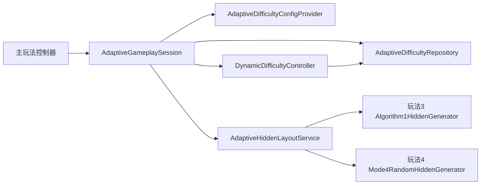
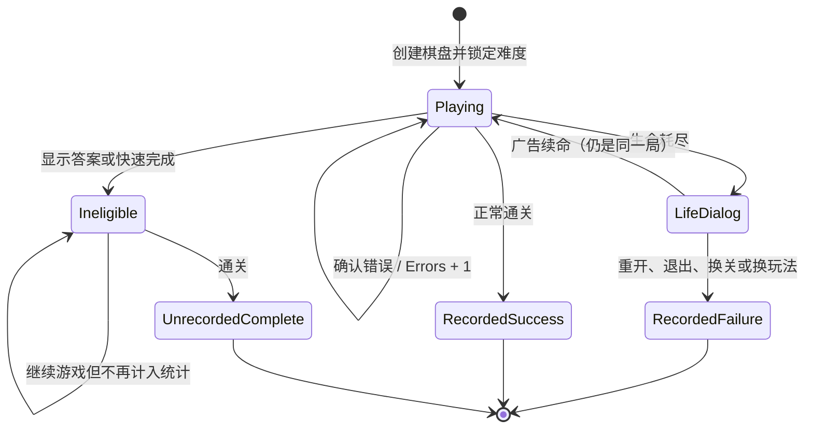

# 玩法3 / 玩法4程序开发交接文档

> 文档状态：可进入开发
> 版本：V1.0
> 更新日期：2026-08-11
> 适用范围：主玩法中的玩法3、玩法4、玩法3算法1隐藏生成、玩法4随机分散隐藏生成和最近5局动态难度系统

> 玩法5已拆为独立实现，不属于本文件的玩法3/4共享范围；见 [玩法5独立实现说明](./gameplay5-implementation.md)。

## 1. 交付目标

程序需要在现有主玩法中实现两个“无拼豆、无拼图奖励”的数字连线玩法：

- **玩法3**：使用算法1生成隐藏布局；根据最近5局表现调整算法1目标难度，但隐藏配置始终固定为 `[20,40] / 3 / 3`。
- **玩法4**：取消算法1难度评分，按动态难度1–10切换隐藏占比区间、最长连续显示和最长连续隐藏，再使用固定种子的简单随机分散方式挑选隐藏数字。
- **难度选择**：设置页允许选择 `动态` 或固定 `1–10`；固定档立即覆盖生成难度，但不修改或采样动态难度历史。

两种玩法共用一套24关路径数据，但必须分别保存：

- 当前关卡进度。
- 当前动态难度。
- 最近5局记录。
- 调整冷却局数。

本文件讲“程序具体怎么接”。算法1内部候选评分、基准点和扩张逻辑见：

- [算法1详细说明](./algorithm1-hidden-generation.md)
- [玩法4随机分散C#完整参考代码](./Mode4RandomHiddenGenerator.cs)
- [动态难度设计说明](./dynamic-difficulty-last-5-games.md)

## 2. 不允许改错的产品规则

| 项目 | 规则 |
|---|---|
| 初始动态难度 | 6 |
| 动态难度范围 | 1–10，整数 |
| 统计窗口 | 最近5个有效对局 |
| 单局计分错误 | `min(本局真实错误数, 3)` |
| 升级条件 | 最近5局计分错误总数0–2，且生命耗尽0局 |
| 保持条件 | 最近5局计分错误总数3–7，且生命耗尽少于2局 |
| 降级条件 | 计分错误总数至少8，或生命耗尽至少2局 |
| 单次变化 | 只能 `+1`、`0`、`-1` |
| 调整冷却 | 实际发生升降后，随后2个有效对局只采样、不再判断 |
| 生效时间 | 新难度只对下一块棋盘生效，禁止中途改当前布局 |
| 手动切换 | 设置中切换动态/固定档时，立即重建当前玩法3/4棋盘并重置为3条生命 |
| 固定档统计 | 固定难度对局不进入最近5局，切回动态后继续原有状态 |
| 玩法3配置 | 固定 `[20,40] / 最长显示3 / 最长隐藏3` |
| 玩法4配置 | 按第5节的10档表取值 |
| 玩法4选点 | 不使用算法1难度评分；难度差异只能来自配置值 |
| 玩法4前段保护 | 数字1～4中最多隐藏1个 |
| 作弊局 | 显示答案或快速完成后，本局不进入动态难度历史 |
| 广告续命 | 不结束本局，继续累计同一局错误 |
| 起点和终点 | 永远显示，不能加入隐藏格集合 |

## 3. 推荐模块拆分

不要把所有逻辑都写进游戏主控制器。建议拆成以下五层：

| 模块 | 职责 | 是否依赖UI |
|---|---|---:|
| `DynamicDifficultyController` | 接收一局结果，计算难度升降 | 否 |
| `AdaptiveDifficultyConfigProvider` | 返回玩法3或玩法4当前配置 | 否 |
| `AdaptiveHiddenLayoutService` | 选占比，并按玩法路由到算法1或随机分散生成器 | 否 |
| `Mode4RandomHiddenGenerator` | 不接收难度值，按配置和固定种子分散选点 | 否 |
| `AdaptiveDifficultyRepository` | 分玩法读取和保存状态 | 否 |
| `AdaptiveGameplaySession` | 管理一局的错误、资格、终局和防重复记录 | 是，接游戏事件 |

整体调用关系：



这样做的原因：动态难度判断和两种隐藏布局生成都可以脱离UI单元测试；以后修改阈值或配置表，不需要改棋盘输入代码。

## 4. 数据结构

以下类型可以直接交给C#程序使用。代码片段采用C# 9/10语法；若项目使用Unity旧版C#，把目标类型 `new(...)` 展开成完整类型名，并把 `TakeLast` 换成文中给出的 `Skip` 写法即可。

```csharp
using System;
using System.Collections.Generic;

public enum AdaptiveGameplayMode
{
    Mode3 = 3,
    Mode4 = 4,
}

public enum DynamicGameResult
{
    Completed,
    LifeDepleted,
}

/// <summary>隐藏配置中的区间是闭区间，例如[20,40]包含20和40。</summary>
public sealed class HiddenDifficultyConfig
{
    public int MinHiddenPercent;
    public int MaxHiddenPercent;
    public int MaxVisibleRun;
    public int MaxHiddenRun;

    public HiddenDifficultyConfig(
        int minHiddenPercent,
        int maxHiddenPercent,
        int maxVisibleRun,
        int maxHiddenRun)
    {
        MinHiddenPercent = minHiddenPercent;
        MaxHiddenPercent = maxHiddenPercent;
        MaxVisibleRun = maxVisibleRun;
        MaxHiddenRun = maxHiddenRun;
    }
}

[Serializable]
public sealed class DynamicGameRecord
{
    // 保存真实错误数；进入公式时才封顶为3。
    public int Errors;
    public DynamicGameResult Result;
    public int LevelId;
    public string FinishedAtUtc = string.Empty;
}

[Serializable]
public sealed class DynamicDifficultyState
{
    public int Version = 1;
    public int CurrentDifficulty = 6;
    public List<DynamicGameRecord> RecentGames = new();
    public int CooldownGames;
    public int TotalEligibleGames;
}

public sealed class DynamicDifficultyDecision
{
    public int PreviousDifficulty;
    public int CurrentDifficulty;
    public int Delta;
    public int WindowErrors;
    public int FailedGames;
    public string Reason = string.Empty;
}

/// <summary>当前棋盘的一次尝试状态，不要和跨局持久化状态混在一起。</summary>
public sealed class AdaptiveAttemptContext
{
    public AdaptiveGameplayMode Mode;
    public int LevelId;
    public int LockedDifficulty;
    public int Errors;
    public bool Recorded;
    public bool Eligible;
    public bool LifeDepleted;
}
```

### 4.1 为什么需要 `LockedDifficulty`

开始棋盘时必须把当前动态难度复制到 `LockedDifficulty`。即使本局期间后台状态被更新，也不能重新生成或替换当前隐藏格。

### 4.2 为什么需要 `Recorded`

同一终局可能同时触发“生命耗尽”“点击重开”“退出界面”等多个事件。写历史前先检查并设置 `Recorded = true`，防止一局被写两次。

### 4.3 为什么需要 `Eligible`

快速完成或显示答案会让本局失去统计资格。此时仍允许正常结束和显示结算，但不能把结果写入最近5局。

## 5. 玩法配置

### 5.1 玩法3

玩法3不根据动态难度切换以下配置：

```text
隐藏占比：[20,40]
最长连续显示：3
最长连续隐藏：3
```

动态难度1–10只传给算法1的 `targetDifficulty`。

### 5.2 玩法4

| 动态难度 | 隐藏占比 | 最长连续显示 | 最长连续隐藏 |
|---:|---:|---:|---:|
| 1 | `[10,15]` | 5 | 2 |
| 2 | `[15,20]` | 5 | 2 |
| 3 | `[20,25]` | 4 | 2 |
| 4 | `[25,30]` | 4 | 2 |
| 5 | `[30,35]` | 3 | 3 |
| 6 | `[35,40]` | 3 | 3 |
| 7 | `[40,45]` | 2 | 4 |
| 8 | `[45,50]` | 2 | 4 |
| 9 | `[50,55]` | 2 | 5 |
| 10 | `[55,60]` | 2 | 5 |

玩法4不把动态难度传入隐藏选择器。难度数字只用于定位本表中的一行；选中配置后，生成器只接收最终隐藏占比、两个连续段上限和不含难度的关卡种子。数字1和末尾固定显示，数字1～4中最多隐藏1个。

C#配置提供器：

```csharp
public static class AdaptiveDifficultyConfigProvider
{
    private static readonly HiddenDifficultyConfig Mode3Config =
        new(20, 40, 3, 3);

    // 数组索引0–9对应动态难度1–10。
    private static readonly HiddenDifficultyConfig[] Mode4Configs =
    {
        new(10, 15, 5, 2),
        new(15, 20, 5, 2),
        new(20, 25, 4, 2),
        new(25, 30, 4, 2),
        new(30, 35, 3, 3),
        new(35, 40, 3, 3),
        new(40, 45, 2, 4),
        new(45, 50, 2, 4),
        new(50, 55, 2, 5),
        new(55, 60, 2, 5),
    };

    public static HiddenDifficultyConfig Get(
        AdaptiveGameplayMode mode,
        int difficulty)
    {
        if (mode == AdaptiveGameplayMode.Mode3)
            return Mode3Config;

        int normalized = Clamp(difficulty, 1, 10);
        return Mode4Configs[normalized - 1];
    }

    private static int Clamp(int value, int min, int max) =>
        Math.Max(min, Math.Min(max, value));
}
```

## 6. 最近5局动态难度实现

### 6.1 一局结束后的固定执行顺序

顺序不能交换：

1. 清洗并加入本局记录。
2. 只保留最后5条。
3. 计算 `windowErrors` 和 `failedGames`。
4. 不满5局：只返回 `warm-up`。
5. 有冷却：冷却减1，只返回 `cooldown`。
6. 先判断降级，再判断升级。
7. 难度限制到1–10。
8. 只有实际难度发生变化时，冷却设为2。
9. 保存对应玩法的状态。

公式：

```text
windowErrors = Σ min(game.Errors, 3)
failedGames = count(game.Result == LifeDepleted)

if failedGames >= 2:
    delta = -1
else if windowErrors >= 8:
    delta = -1
else if failedGames == 0 and windowErrors <= 2:
    delta = +1
else:
    delta = 0
```

### 6.2 C#参考实现

```csharp
using System;
using System.Linq;

public static class DynamicDifficultyController
{
    private const int MinDifficulty = 1;
    private const int MaxDifficulty = 10;
    private const int WindowSize = 5;
    private const int AdjustmentCooldown = 2;

    public static DynamicDifficultyDecision RecordGame(
        DynamicDifficultyState state,
        int rawErrors,
        DynamicGameResult result,
        int levelId,
        DateTime finishedAtUtc)
    {
        if (state == null) throw new ArgumentNullException(nameof(state));
        NormalizeState(state);

        state.RecentGames.Add(new DynamicGameRecord
        {
            Errors = Math.Max(0, rawErrors),
            Result = result,
            LevelId = levelId,
            FinishedAtUtc = finishedAtUtc.ToUniversalTime().ToString("O"),
        });

        while (state.RecentGames.Count > WindowSize)
            state.RecentGames.RemoveAt(0);

        state.TotalEligibleGames += 1;

        int previous = state.CurrentDifficulty;
        int windowErrors = state.RecentGames.Sum(game =>
            Math.Min(Math.Max(0, game.Errors), 3));
        int failedGames = state.RecentGames.Count(game =>
            game.Result == DynamicGameResult.LifeDepleted);

        if (state.RecentGames.Count < WindowSize)
        {
            return MakeDecision(
                previous, previous, windowErrors, failedGames, "warm-up");
        }

        // 调整后的后续两局仍写入历史，但完整跳过难度判断。
        if (state.CooldownGames > 0)
        {
            state.CooldownGames -= 1;
            return MakeDecision(
                previous, previous, windowErrors, failedGames, "cooldown");
        }

        int requestedDelta = 0;
        string reason = "steady";

        // 降级优先级高于升级。
        if (failedGames >= 2)
        {
            requestedDelta = -1;
            reason = "lowered-failures";
        }
        else if (windowErrors >= 8)
        {
            requestedDelta = -1;
            reason = "lowered-errors";
        }
        else if (failedGames == 0 && windowErrors <= 2)
        {
            requestedDelta = 1;
            reason = "raised";
        }

        int current = Clamp(
            previous + requestedDelta,
            MinDifficulty,
            MaxDifficulty);
        int actualDelta = current - previous;
        state.CurrentDifficulty = current;

        if (actualDelta != 0)
        {
            state.CooldownGames = AdjustmentCooldown;
        }
        else if (requestedDelta != 0)
        {
            // 已经到1或10，不能继续变化；这种情况不启动冷却。
            reason = "difficulty-limit";
        }

        return MakeDecision(
            previous, current, windowErrors, failedGames, reason);
    }

    public static void NormalizeState(DynamicDifficultyState state)
    {
        state.Version = 1;
        state.CurrentDifficulty = Clamp(state.CurrentDifficulty, 1, 10);
        state.CooldownGames = Clamp(state.CooldownGames, 0, 2);
        state.RecentGames ??= new System.Collections.Generic.List<DynamicGameRecord>();
        state.RecentGames = state.RecentGames
            .Where(game => game != null && Enum.IsDefined(
                typeof(DynamicGameResult),
                game.Result))
            .TakeLast(WindowSize)
            .ToList();
        state.TotalEligibleGames = Math.Max(
            state.RecentGames.Count,
            Math.Max(0, state.TotalEligibleGames));

        foreach (DynamicGameRecord game in state.RecentGames)
            game.Errors = Math.Max(0, game.Errors);
    }

    private static DynamicDifficultyDecision MakeDecision(
        int previous,
        int current,
        int windowErrors,
        int failedGames,
        string reason)
    {
        return new DynamicDifficultyDecision
        {
            PreviousDifficulty = previous,
            CurrentDifficulty = current,
            Delta = current - previous,
            WindowErrors = windowErrors,
            FailedGames = failedGames,
            Reason = reason,
        };
    }

    private static int Clamp(int value, int min, int max) =>
        Math.Max(min, Math.Min(max, value));
}
```

> 若Unity运行时不支持 `TakeLast`，用 `Skip(Math.Max(0, Count - 5))` 替代。

## 7. 隐藏布局生成接入

### 7.1 必须使用完整路径重新生成

玩法3和玩法4都不能直接使用关卡文件中已有的 `hiddenCells`。程序需要读取：

- `solutionPath`
- 棋盘形状
- 行列数
- `levelId`

玩法3调用算法1重新得到隐藏索引；玩法4调用随机分散选择器。两者都必须排除起点索引0和终点索引 `path.Count - 1`。

### 7.2 区间占比如何取值

配置中的 `[min,max]` 是闭区间。不能每次进入关卡都调用普通随机数，否则同一关重开时隐藏数量会变化。

正确做法：

1. 用 `levelId + rows + columns + pathLength` 生成稳定整数种子。
2. 用无符号种子对区间长度取模。
3. 玩法3的占比种子**不能包含动态难度**。
4. 玩法3布局种子可以包含动态难度，使难度变化后算法1重新选择结构。
5. 玩法4随机种子禁止包含动态难度；难度差异只能来自配置表。

C#实现：

```csharp
public static class AdaptiveHiddenSeed
{
    public static int SelectEffectivePercent(
        int levelId,
        int rows,
        int columns,
        int pathLength,
        HiddenDifficultyConfig config)
    {
        int min = Clamp(config.MinHiddenPercent, 0, 100);
        int max = Clamp(config.MaxHiddenPercent, min, 100);
        int span = max - min + 1;

        int signedSeed;
        unchecked
        {
            // 不要使用string.GetHashCode：不同进程或平台可能得到不同结果。
            signedSeed = ((levelId + 1) * (int)2654435761u)
                ^ ((rows + 1) * (int)2246822519u)
                ^ ((columns + 1) * (int)3266489917u)
                ^ ((pathLength + 1) * 668265263)
                ^ (int)0x16d4b4f3u;
        }

        uint unsignedSeed = unchecked((uint)signedSeed);
        return min + (int)(unsignedSeed % (uint)span);
    }

    public static int CreateMode3LayoutSeed(
        int levelId,
        int rows,
        int columns,
        int pathLength,
        int difficulty)
    {
        int normalizedDifficulty = Clamp(difficulty, 1, 10);
        unchecked
        {
            return ((levelId + 1) * 104729)
                ^ ((rows + 1) * 73856093)
                ^ ((columns + 1) * 19349663)
                ^ ((normalizedDifficulty + 1) * 83492791)
                ^ pathLength
                ^ (int)0x3a8f05c1u;
        }
    }

    public static int CreateMode4RandomSeed(
        int levelId,
        int rows,
        int columns,
        int pathLength)
    {
        unchecked
        {
            return ((levelId + 1) * 104729)
                ^ ((rows + 1) * 73856093)
                ^ ((columns + 1) * 19349663)
                ^ pathLength
                ^ (int)0x53c9e4abu;
        }
    }

    private static int Clamp(int value, int min, int max) =>
        Math.Max(min, Math.Min(max, value));
}
```

### 7.3 玩法配置占比直接生效

这是最容易实现错误的地方。

算法1编辑器默认仍可使用原规则：

```text
算法1最终占比 = requestedHiddenPercent + targetDifficulty
```

玩法3已经取消“额外增加难度百分点”的隐藏补偿，运行时必须显式关闭该选项：

```text
addTargetDifficultyPercent = false
requestedHiddenPercent = effectiveHiddenPercent
最终隐藏占比 = effectiveHiddenPercent
```

玩法4不调用算法1，选中的占比直接交给随机分散选择器。例如难度6某关从 `[35,40]` 选出38：

```text
传给玩法4随机选择器的 hiddenPercent = 38
最终隐藏占比 = 38
```

不能执行 `38 - 6` 的反向扣减，也不能再加6。数字6只用于选择第6档配置，不参与隐藏候选评分或随机种子。

### 7.4 布局服务参考接口

```csharp
public interface IAlgorithm1HiddenGenerator
{
    // 返回solutionPath中的隐藏索引，不返回坐标更容易保证顺序正确。
    System.Collections.Generic.HashSet<int> Generate(
        System.Collections.Generic.IReadOnlyList<Cell> solutionPath,
        BoardShape shape,
        double requestedHiddenPercent,
        int targetDifficulty,
        int seed,
        int maxVisibleRun,
        int maxHiddenRun,
        bool addTargetDifficultyPercent);
}

public interface IMode4RandomHiddenGenerator
{
    System.Collections.Generic.HashSet<int> Generate(
        System.Collections.Generic.IReadOnlyList<Cell> solutionPath,
        double hiddenPercent,
        int seed,
        int maxVisibleRun,
        int maxHiddenRun,
        int firstNumberWindow,
        int maxHiddenInFirstWindow);
}

public sealed class AdaptiveHiddenLayoutService
{
    private readonly IAlgorithm1HiddenGenerator _algorithm1;
    private readonly IMode4RandomHiddenGenerator _mode4Random;

    public AdaptiveHiddenLayoutService(
        IAlgorithm1HiddenGenerator algorithm1,
        IMode4RandomHiddenGenerator mode4Random)
    {
        _algorithm1 = algorithm1;
        _mode4Random = mode4Random;
    }

    public System.Collections.Generic.HashSet<int> CreateHiddenIndices(
        AdaptiveGameplayMode mode,
        LevelData level,
        int difficulty)
    {
        int normalizedDifficulty = Math.Max(1, Math.Min(10, difficulty));
        HiddenDifficultyConfig config =
            AdaptiveDifficultyConfigProvider.Get(mode, normalizedDifficulty);

        int effectivePercent = AdaptiveHiddenSeed.SelectEffectivePercent(
            level.LevelId,
            level.Rows,
            level.Columns,
            level.SolutionPath.Count,
            config);

        System.Collections.Generic.HashSet<int> result;
        if (mode == AdaptiveGameplayMode.Mode3)
        {
            int seed = AdaptiveHiddenSeed.CreateMode3LayoutSeed(
                level.LevelId,
                level.Rows,
                level.Columns,
                level.SolutionPath.Count,
                normalizedDifficulty);

            result = _algorithm1.Generate(
                level.SolutionPath,
                level.BoardShape,
                effectivePercent,
                normalizedDifficulty,
                seed,
                config.MaxVisibleRun,
                config.MaxHiddenRun,
                addTargetDifficultyPercent: false);
        }
        else
        {
            int seed = AdaptiveHiddenSeed.CreateMode4RandomSeed(
                level.LevelId,
                level.Rows,
                level.Columns,
                level.SolutionPath.Count);

            result = _mode4Random.Generate(
                level.SolutionPath,
                effectivePercent,
                seed,
                config.MaxVisibleRun,
                config.MaxHiddenRun,
                firstNumberWindow: 4,
                maxHiddenInFirstWindow: 1);
        }

        // 双重保护：即使底层算法异常，也不能隐藏起点和终点。
        result.Remove(0);
        result.Remove(level.SolutionPath.Count - 1);
        return result;
    }
}
```

### 7.5 玩法4随机分散规则

玩法4选择器只做结构约束和带种子的随机打散，不接收动态难度：

1. `targetCount = round(pathLength × hiddenPercent / 100)`。
2. 候选仅包含路径下标 `1 ... pathLength - 2`，首尾固定显示。
3. 下标小于4的隐藏数量最多为1，也就是数字1～4最多隐藏1个。
4. 每轮优先减少连续隐藏/显示超限，再优先选择离已有隐藏点更远的数字。
5. 完全同分时按关卡固定种子打散；同关同配置重玩结果一致。
6. 选择器没有 `targetDifficulty` 参数，不计算算法1体验目标、扩张配额或难度损失。

完整C#实现见 [Mode4RandomHiddenGenerator.cs](./Mode4RandomHiddenGenerator.cs)。

### 7.6 玩法3算法1基准点规则

目标隐藏数量确定后：

```text
baseSelectionCount = ceil(targetHiddenCount × 10%)
```

注意是目标隐藏数量的前10%，不是固定前10步，也不是完整路径的10%。剩余隐藏格再按目标难度进行扩张和候选评分。

### 7.7 连续段参数的可行性说明

当前上线版本的优先级是：

1. 起点和终点必须显示。
2. 隐藏数量必须匹配目标占比。
3. 在数学可行时满足最长连续显示和最长连续隐藏。
4. 如果目标隐藏数量与连续段限制冲突，算法保留目标数量，并对连续段做最佳努力。

例如路径很长、隐藏占比只有10%，但要求最长连续显示不超过5，数学上可能无法同时成立。如果产品以后要求连续段绝对不超限，需要在生成前明确选择一种新策略：提高隐藏数量、重新配置区间，或判定该关卡配置不可用。不能在程序中静默同时承诺两个互相冲突的硬条件。

## 8. 单局生命周期接入

### 8.1 事件流程



### 8.2 开始棋盘

```csharp
public AdaptiveAttemptContext BeginAttempt(
    AdaptiveGameplayMode mode,
    int levelId,
    DynamicDifficultyState state)
{
    return new AdaptiveAttemptContext
    {
        Mode = mode,
        LevelId = levelId,
        LockedDifficulty = Math.Max(1, Math.Min(10, state.CurrentDifficulty)),
        Errors = 0,
        Recorded = false,
        Eligible = true,
        LifeDepleted = false,
    };
}
```

使用 `LockedDifficulty` 生成隐藏格，然后整局复用生成结果。

### 8.3 错误事件

只监听棋盘已经确认的错误事件，不要监听指针移动或碰撞次数：

```csharp
public void OnWrong(AdaptiveAttemptContext attempt)
{
    if (!attempt.Recorded)
        attempt.Errors += 1;
}
```

### 8.4 显示答案与快速完成

```csharp
public void InvalidateAttempt(AdaptiveAttemptContext attempt)
{
    attempt.Eligible = false;
}
```

一旦失去资格，本局之后即使关闭答案也不能恢复资格。

### 8.5 生命耗尽与广告续命

生命耗尽时先标记：

```csharp
attempt.LifeDepleted = true;
```

此时不要立刻写入失败，因为玩家可能观看广告继续。广告续命后：

- 不创建新 `AdaptiveAttemptContext`。
- 不清零错误数。
- 不写入历史。
- 继续使用原隐藏布局和 `LockedDifficulty`。

只有玩家在生命耗尽界面选择重开、退出、切关或切换玩法，才记录 `LifeDepleted`。

### 8.6 通关、失败和防重复写入

```csharp
public DynamicDifficultyDecision? FinishAttempt(
    AdaptiveAttemptContext attempt,
    DynamicDifficultyState state,
    DynamicGameResult result)
{
    if (attempt.Recorded)
        return null;

    // 先置位，防止多个UI事件重复进入。
    attempt.Recorded = true;

    if (!attempt.Eligible)
        return null;

    return DynamicDifficultyController.RecordGame(
        state,
        attempt.Errors,
        result,
        attempt.LevelId,
        DateTime.UtcNow);
}
```

`FinishAttempt` 返回非空决定后，调用层必须立即执行：

```csharp
DynamicDifficultyDecision? decision = FinishAttempt(attempt, state, result);
if (decision != null)
    repository.Save(attempt.Mode, state);
```

先更新内存状态、再保存对应玩法，不能把玩法3状态写进玩法4槽位。

调用规则：

| 场景 | 是否调用 | Result |
|---|---:|---|
| 正常通关 | 是 | `Completed` |
| 生命耗尽后点重开 | 是 | `LifeDepleted` |
| 生命耗尽后退出 | 是 | `LifeDepleted` |
| 生命耗尽后换关 | 是 | `LifeDepleted` |
| 生命耗尽后切玩法 | 先记录旧玩法，再切换 | `LifeDepleted` |
| 广告续命 | 否 | — |
| 普通中途退出且未耗尽生命 | 否 | — |
| 显示答案或快速完成 | 调用也不写历史 | — |

## 9. 持久化要求

### 9.1 两个玩法必须分开保存

Web当前键名：

```text
玩法3动态难度：number-connect.dynamic-difficulty.v1
玩法4动态难度：number-connect.mode4-dynamic-difficulty.v1
通用设置与关卡进度：number-connect.settings.v1
```

设置结构中分别保存：

```text
mainGameplayDifficulty = "dynamic" 或 1–10
mode3MainLevelId
mode4MainLevelId
```

`mainGameplayDifficulty` 是两个玩法共用的用户选择，默认和非法值都回退为 `dynamic`。它只决定下一次生成时采用“对应玩法的动态状态”还是“固定数字”，不能写回 `DynamicDifficultyState.currentDifficulty`。

原生客户端可以换成自己的存档键，但逻辑上必须保持两个独立槽位。推荐接口：

```csharp
public interface IAdaptiveDifficultyRepository
{
    DynamicDifficultyState Load(AdaptiveGameplayMode mode);
    void Save(AdaptiveGameplayMode mode, DynamicDifficultyState state);
}

public interface IAdaptiveLevelProgressRepository
{
    int LoadLevelId(AdaptiveGameplayMode mode);
    void SaveLevelId(AdaptiveGameplayMode mode, int levelId);
}
```

### 9.2 加载清洗

读取存档后必须：

- 非法JSON或缺字段时回退到难度6、空历史、冷却0。
- 难度截断到1–10。
- 冷却截断到0–2。
- 错误次数小于0时改为0。
- 历史超过5条时只保留最后5条。
- 非法结果类型丢弃。
- 关卡ID不在24关中时回退到第1关。

### 9.3 服务端存档注意事项

如果改为异步服务端存档，建议给每次尝试增加唯一 `attemptId`，服务端按 `attemptId` 幂等写入，避免断线重试产生重复对局。难度计算与状态写入应在同一事务或同一原子更新中完成。

## 10. 主玩法与UI接入

程序需要完成：

1. 主玩法枚举增加 `Mode3`、`Mode4`。
2. 设置页增加玩法3、玩法4选项。
3. 在主玩法下一行增加难度下拉框：`动态`、`难度1`……`难度10`；拼豆/拼图时禁用。
4. 玩法3和玩法4都读取同一套24关路径资源。
5. 两者使用各自保存的当前关卡ID。
6. 动态标题显示 `玩法3 · 难度 N（动态） · 关卡 X`；固定档标题显示 `玩法3 · 难度 N · 关卡 X`，玩法4同理。
7. 在对局内改变难度选择时，隐藏结算层、恢复3条生命、清空本局错误并用同一关卡重新生成。
8. 两者不显示拼豆罐、拼豆飞行动画、拼图画面或对应奖励。
9. 动态模式完成后显示本局错误数、当前/下一局难度和调整原因；固定模式说明本局不计入动态难度。
10. 自动难度变化后提示“下一关生效”。

建议结算文案：

```text
本局错误 1 次。动态难度由 6 提升到 7，下一关生效。
本局错误 2 次。动态难度采样 3/5，当前维持 6。
本局错误 3 次。调整冷却期继续采样，难度维持 5。
本局使用过答案或快速完成，不计入动态难度。
本局错误 1 次。当前使用固定难度 8，本局不计入动态难度。
```

## 11. 推荐开发顺序

### 第一步：纯逻辑层

- 建立数据结构。
- 完成10档配置提供器。
- 完成 `DynamicDifficultyController`。
- 先写单元测试，不接UI。

### 第二步：两种隐藏生成器

- 玩法3接入完整算法1。
- 玩法4接入简单随机分散选择器，禁止传入目标难度。
- 实现稳定占比种子。
- 玩法3关闭额外难度百分点；玩法4直接使用配置占比。
- 验证起终点不隐藏、数字1～4最多隐藏1个、相同输入结果稳定。

### 第三步：持久化

- 建立玩法3、玩法4独立状态槽。
- 建立独立关卡进度。
- 加入损坏存档回退和版本字段。

### 第四步：单局生命周期

- 开局锁定难度。
- 接错误事件。
- 接通关、生命耗尽、广告续命、重开、退出、换关、换玩法。
- 接快速完成和答案导致的失效。

### 第五步：主玩法UI

- 增加入口和标题。
- 关闭拼豆/拼图展示与奖励。
- 增加结算难度说明。

### 第六步：联调与数据验证

- 连续模拟至少20局。
- 检查两个玩法历史不串档。
- 检查难度变化只影响下一局。
- 检查同一关、同一难度重开布局一致。

## 12. 必测用例

### 12.1 动态难度

| 用例 | 预期 |
|---|---|
| 前4个有效对局 | 只采样，不调整 |
| `[0,0,1,0,1]` | 难度6升到7，冷却变2 |
| `[1,0,2,1,1]` | 难度保持6 |
| `[2,2,1,3,2]` | 难度6降到5 |
| 两次生命耗尽、总错误6 | 仍然降1级 |
| 单局真实错误7 | 历史保存7，公式只按3计 |
| 调整后两局 | 只采样，冷却依次2→1→0 |
| 难度10仍满足升级 | 保持10，不启动冷却 |
| 难度1仍满足降级 | 保持1，不启动冷却 |

### 12.2 玩法配置

| 用例 | 预期 |
|---|---|
| 玩法3难度1和10 | 配置始终 `[20,40] / 3 / 3` |
| 玩法3同关不同难度 | 最终隐藏占比相同，布局结构可以不同 |
| 玩法4难度1 | 最终占比位于 `[10,15]`，连续参数5/2 |
| 玩法4难度10 | 最终占比位于 `[55,60]`，连续参数2/5 |
| 玩法4逐级检查 | 10档逐项匹配配置表 |
| 玩法3算法1占比 | 最终占比等于选定占比，不再额外加难度 |
| 玩法4生成器 | 不调用算法1，难度值不进入选点评分或随机种子 |
| 玩法4前段保护 | 任意关卡、任意档位的数字1～4最多隐藏1个 |

### 12.3 生命周期

| 用例 | 预期 |
|---|---|
| 同一局触发两个退出回调 | 历史只增加1条 |
| 生命耗尽后广告续命并通关 | 只记录1条 `Completed` |
| 生命耗尽后直接重开 | 记录1条 `LifeDepleted` |
| 显示答案后通关 | 不写历史 |
| 快速完成 | 不写历史 |
| 未耗尽生命主动退出 | 不写历史 |
| 玩法3玩5局后切玩法4 | 玩法4仍使用自己的初始/历史状态 |
| 动态切固定难度8 | 同一关立即按难度8重建，生命和错误计数重置 |
| 固定难度8通关/失败 | 不写玩法3或玩法4的动态历史 |
| 固定切回动态 | 恢复对应玩法之前保存的动态难度与最近5局 |

### 12.4 存档

| 用例 | 预期 |
|---|---|
| JSON损坏 | 回退难度6，不崩溃 |
| 难度存成99 | 加载为10 |
| 冷却存成99 | 加载为2 |
| 历史7条 | 只保留最后5条 |
| 玩法4关卡ID不存在 | 回退第1关 |

## 13. 日志与线上观察

建议每个有效对局结束时输出一条结构化事件：

```json
{
  "mode": "mode4",
  "levelId": 8,
  "rawErrors": 2,
  "result": "completed",
  "previousDifficulty": 6,
  "currentDifficulty": 7,
  "delta": 1,
  "windowErrors": 2,
  "failedGames": 0,
  "reason": "raised",
  "cooldownGames": 2
}
```

至少观察：

- 每个难度的平均停留局数。
- 升级后两局内生命耗尽率。
- 降级后错误是否回到3–7目标带。
- 难度1和10的长期占比。
- 玩法3/玩法4存档串档异常。

## 14. 当前网页项目代码对应关系

| 功能 | 当前文件 |
|---|---|
| 动态难度状态与最近5局公式 | `src/gameplay/mode3/dynamicDifficulty.ts` |
| 玩法3/4配置、占比种子和生成器路由 | `src/gameplay/mode3/mode3HiddenLayout.ts` |
| 玩法4随机分散选择器 | `src/gameplay/mode3/mode4RandomHiddenLayout.ts` |
| 主流程、错误、终局、UI接入 | `src/main.ts` |
| 主玩法类型、难度选择与独立关卡ID | `src/game/types.ts` |
| 设置与关卡资源加载 | `src/game/storage.ts` |
| 24关资源 | `public/levels/mode3-levels.json` |
| 动态难度测试 | `src/gameplay/mode3/dynamicDifficulty.test.ts` |
| 隐藏布局配置测试 | `src/gameplay/mode3/mode3HiddenLayout.test.ts` |
| 玩法4随机分散规则测试 | `src/gameplay/mode3/mode4RandomHiddenLayout.test.ts` |

## 15. 完成定义

只有同时满足以下条件，才算程序接入完成：

- 玩法3、玩法4可独立选关和通关。
- 两种玩法不出现拼豆或拼图奖励。
- 最近5局升降、冷却和边界规则全部通过自动测试。
- 玩法3固定配置不会随难度变化。
- 玩法4完整匹配10档表。
- 玩法3算法1没有重复叠加隐藏占比。
- 玩法4不调用算法1，且数字1～4最多隐藏1个。
- 当前棋盘不会中途改变难度或隐藏格。
- 广告续命、答案、快速完成、退出等边界不会重复或错误记局。
- 两个玩法的难度历史和关卡进度完全独立。
- 设置页可在动态与固定1–10间切换，对局内切换会立即重建。
- 固定档不会污染或覆盖动态难度历史。
- 存档损坏时可以安全回退。
