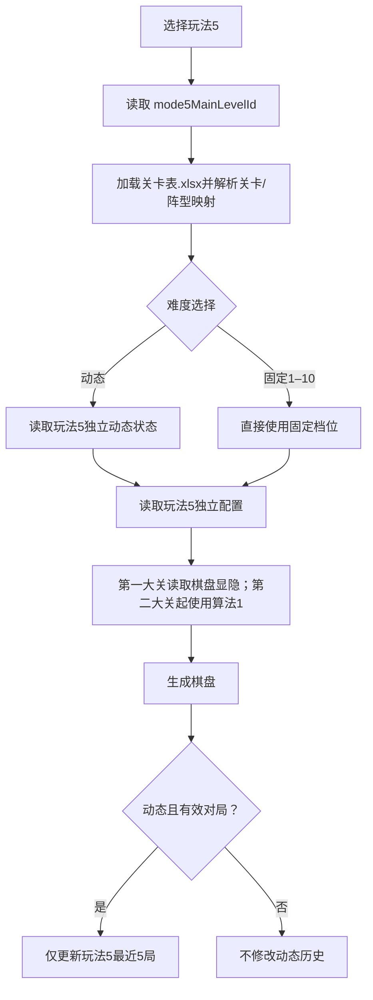

# 玩法5独立实现说明

## 1. 当前基线

玩法5已经作为新的主玩法接入。初始体验以玩法4为模板：

- 难度支持 `动态` 和固定 `1–10`。
- 动态难度初始为1，统计最近5局错误。
- 第一大关直接读取 Excel 阵型中的正负数棋盘数据，不调用算法；第二大关起使用算法1生成隐藏布局，并使用玩法5自己的配置、种子和动态难度。
- 起点数字1和终点固定显示，数字1～4最多隐藏1个。
- 第1大关包含顺序关卡1～2两个小阶段；此后每4个顺序关卡组成一个大关。
- 非最后小阶段完成后直接进入下一阶段，不显示结算弹窗；大关最后阶段完成后显示关卡结算。
- 当前10档隐藏占比及连续段参数与玩法4一致。

这只是玩法5的初始版本。玩法5没有直接调用玩法4生成器，后续可以单独修改。

## 2. 独立边界

| 内容 | 玩法5独立位置 |
|---|---|
| 主玩法枚举和独立关卡进度 | `src/game/types.ts` 中的 `mode5`、`mode5MainLevelId` |
| 关卡与阵型资源 | `excel/关卡表.xlsx` 的“关卡”“阵型”sheet |
| 10档参数和关卡种子 | `src/gameplay/mode5/mode5HiddenLayout.ts` |
| 算法1选点入口 | `src/gameplay/mode5/mode5HiddenLayout.ts` |
| 动态难度公式和状态 | `src/gameplay/mode5/dynamicDifficulty.ts` |
| 大关/小阶段映射 | `src/gameplay/mode5/mode5Campaign.ts` |
| 动态存档键 | `number-connect.mode5-dynamic-difficulty.v1` |
| 运行时路由 | `src/main.ts` |

玩法5只复用棋盘、设置对话框、事件回调等通用基础设施。玩法3/4的配置、种子、生成器、动态难度状态和关卡进度都不会被玩法5写入。

## 3. 当前10档配置

| 难度 | 隐藏占比 | 最长连续显示 | 最长连续隐藏 |
|---:|---:|---:|---:|
| 1 | `[20,26]` | 4 | 2 |
| 2 | `[26,32]` | 4 | 2 |
| 3 | `[32,37]` | 4 | 2 |
| 4 | `[37,42]` | 3 | 2 |
| 5 | `[42,46]` | 3 | 2 |
| 6 | `[46,50]` | 3 | 3 |
| 7 | `[50,53]` | 3 | 3 |
| 8 | `[53,56]` | 2 | 3 |
| 9 | `[56,58]` | 2 | 3 |
| 10 | `[58,60]` | 2 | 3 |

后续只修改玩法5时，优先改 `MODE5_DIFFICULTY_CONFIGS`，不要改玩法4的 `MODE4_DIFFICULTY_CONFIGS`。

## 4. 运行流程

## 5. 后续修改原则

- 改玩法5隐藏占比或连续段：修改 `mode5HiddenLayout.ts`。
- 改玩法5算法1接入或选点策略：修改 `mode5HiddenLayout.ts`。
- 改玩法5升降阈值、窗口或冷却：修改 `mode5/dynamicDifficulty.ts`。
- 改玩法5大关、阶段或阵型：修改 `excel/关卡表.xlsx`。
- 不要为了修改玩法5去改玩法3/4目录中的实现。

每次修改后至少运行玩法5单元测试、完整 `npm test` 和 `npm run build`。
